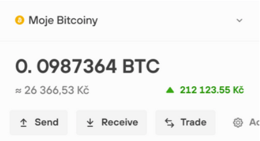

# Trezor Demo

The goal of this project is to demonstrate implementation of basic design in React Native. No business logic, all data just mocked.

## Android app

You could download and install android version of this demo app here:
https://install.appcenter.ms/users/matejkriz.cz/apps/trezordemo/distribution_groups/public

## Prerequisities

- [Setup your machine for iOS and Android](https://facebook.github.io/react-native/docs/getting-started.html)
- Click on `Building Projects with Native Code` tab and follow instructions.

## Devstack

- Typescript
- Prettier
- ESLint
- Husky (run ts check, eslint and jest before every commit)
- AppCenter: build APK on every push, basic analytics and crashlitics

## Notes

- The design was made for 375px wide screen so size utility is defined in theme.ts to slightly accomodate the sizes by the screen size of the device to prevent huge/tiny elements. Has to be discussed with the desiger.
- TTHoves font from the design is paid so free custom font is used instead.

## Next steps?

- Extract hardcoded content to mock utility or even on backend.
- Add i18n library and put all text there.
- Add utility for localizable number formatting.
- Add nice app icon and splash screen.
- Secure signing Android builds on AppCenter (public keystore is ok only for demo purposes).
